# 📚 Документация проекта: plant_protection_app

**Дата генерации:** 2025-12-07 14:52:26  
**Путь к проекту:** `C:\Users\Нелли\Desktop\file_for_run_python\plant_protection_app`  
**Версия документации:** 1.0.0  

> Автоматически сгенерировано с помощью AdvancedDocumentationGenerator
---
## 📑 Оглавление
- [📊 Обзор проекта](#обзор-проекта)
- [📁 Модули](#модули)
- [🏛️ Классы](#классы)
- [⚙️ Функции](#функции)
- [🔗 Зависимости](#зависимости)
- [📈 Статистика](#статистика)

---
<a id="обзор-проекта"></a>
## 📊 Обзор проекта
### Структура проекта
```
📄 advanced_documentation.py
📄 export_project_v1.py
📄 main.py
📄 main_db_test.py
📄 migrate_db.py
```

### Быстрый старт
```bash
# Установка зависимостей
pip install -r requirements.txt

# Запуск проекта
python main.py
```

<a id="модули"></a>
## 📁 Модули

### 🗂️ `advanced_documentation`
**Файл:** `advanced_documentation.py`  

**Описание:** Advanced Project Documentation Generator
Автоматически создает полную документацию проекта с анализом зависимостей,
type hints и диаграммами связей.

**Импортирует:**
- `argparse`
- `ast`
- `dataclasses.asdict`
- `dataclasses.dataclass`
- `dataclasses.field`
- `datetime.datetime`
- `enum.Enum`
- `graphviz`
- `graphviz.Digraph`
- `inspect`
- ... и еще 12

**Классы (7):**
- `ElementType` (строка 28)
- `ArgumentInfo` (строка 38)
- `FunctionInfo` (строка 55)
- `ClassInfo` (строка 86)
- `ModuleInfo` (строка 111)
- `ProjectStats` (строка 126)
- `AdvancedDocumentationGenerator` (строка 138)

**Функции (2):**
- `main()` (строка 1134)
- `print_dir_structure()` (строка 690)

---

### 🗂️ `app.__init__`
**Файл:** `app\__init__.py`  

---

### 🗂️ `app.core.__init__`
**Файл:** `app\core\__init__.py`  

---

### 🗂️ `app.core.config`
**Файл:** `app\core\config.py`  

**Импортирует:**
- `os`
- `pathlib.Path`

**Классы (1):**
- `AppConfig` (строка 4)

---

### 🗂️ `app.core.database`
**Файл:** `app\core\database.py`  

**Импортирует:**
- `app.core.config.AppConfig`
- `pathlib.Path`
- `sqlite3`

**Классы (1):**
- `DatabaseManager` (строка 5)

**Функции (5):**
- `search_pesticides()` (строка 233)
- `_load_disease_classes_from_file()` (строка 255)
- `_create_default_disease_classes()` (строка 293)
- `export_disease_classes_to_file()` (строка 321)
- `close()` (строка 251)

---

### 🗂️ `app.core.database_backup`
**Файл:** `app\core\database_backup.py`  

**Описание:** БАЗА ДАННЫХ - ТЕСТОВАЯ ВЕРСИЯ С ДАННЫМИ
Используется только с main_db_test.py

**Импортирует:**
- `app.core.test_data.get_test_data`
- `pathlib.Path`
- `sqlite3`

**Классы (1):**
- `DatabaseManagerBackup` (строка 10)

**Функции (3):**
- `export_disease_classes_to_file()` (строка 338)
- `_load_disease_classes_from_file()` (строка 360)
- `_create_default_disease_classes()` (строка 398)

---

### 🗂️ `app.core.test_data`
**Файл:** `app\core\test_data.py`  

**Описание:** ТЕСТОВЫЕ ДАННЫЕ ДЛЯ БАЗЫ ДАННЫХ
Используется только в тестовом режиме (main_db_test.py)

**Функции (1):**
- `get_test_data()` (строка 6)

---

### 🗂️ `app.ml.__init__`
**Файл:** `app\ml\__init__.py`  

---

### 🗂️ `app.ml.image_processor`
**Файл:** `app\ml\image_processor.py`  

**Импортирует:**
- `PIL.Image`
- `cv2`
- `numpy`

**Классы (1):**
- `ImageProcessor` (строка 5)

---

### 🗂️ `app.ml.model_loader`
**Файл:** `app\ml\model_loader.py`  

**Импортирует:**
- `numpy`
- `tensorflow`

**Классы (1):**
- `ModelLoader` (строка 4)

---

### 🗂️ `app.ui.__init__`
**Файл:** `app\ui\__init__.py`  

---

### 🗂️ `app.ui.screens.__init__`
**Файл:** `app\ui\screens\__init__.py`  

---

### 🗂️ `app.ui.screens.camera_screen`
**Файл:** `app\ui\screens\camera_screen.py`  

---

### 🗂️ `app.ui.screens.catalog_screen`
**Файл:** `app\ui\screens\catalog_screen.py`  

**Импортирует:**
- `kivy.lang.Builder`
- `kivy.metrics.dp`
- `kivy.properties.BooleanProperty`
- `kivy.properties.ListProperty`
- `kivy.properties.StringProperty`
- `kivy.uix.relativelayout.RelativeLayout`
- `kivy.uix.screenmanager.Screen`
- `kivymd.uix.bottomnavigation.MDBottomNavigationItem`
- `kivymd.uix.boxlayout.MDBoxLayout`
- `kivymd.uix.button.MDFlatButton`
- ... и еще 13

**Классы (5):**
- `PesticideCard` (строка 566)
- `FilterDialog` (строка 628)
- `SortDialog` (строка 656)
- `EditPesticideDialog` (строка 687)
- `CatalogTab` (строка 810)

---

### 🗂️ `app.ui.screens.disease_detection_screen`
**Файл:** `app\ui\screens\disease_detection_screen.py`  

**Импортирует:**
- `kivy.lang.Builder`
- `kivymd.uix.bottomnavigation.MDBottomNavigationItem`
- `kivymd.uix.boxlayout.MDBoxLayout`
- `kivymd.uix.label.MDLabel`

**Классы (1):**
- `DiseaseDetectionScreen` (строка 18)

---

### 🗂️ `app.ui.screens.main_screen`
**Файл:** `app\ui\screens\main_screen.py`  

**Импортирует:**
- `app.ui.screens.catalog_screen.CatalogTab`
- `app.ui.screens.settings_screen.SettingsTab`
- `kivy.lang.Builder`
- `kivy.uix.screenmanager.Screen`
- `kivymd.uix.bottomnavigation.MDBottomNavigation`
- `kivymd.uix.bottomnavigation.MDBottomNavigationItem`
- `kivymd.uix.boxlayout.MDBoxLayout`
- `kivymd.uix.label.MDLabel`

**Классы (3):**
- `DiagnosisTab` (строка 49)
- `OrdersTab` (строка 52)
- `MainScreen` (строка 55)

---

### 🗂️ `app.ui.screens.orders_screen`
**Файл:** `app\ui\screens\orders_screen.py`  

**Импортирует:**
- `kivy.lang.Builder`
- `kivymd.uix.bottomnavigation.MDBottomNavigationItem`
- `kivymd.uix.boxlayout.MDBoxLayout`
- `kivymd.uix.label.MDLabel`

**Классы (1):**
- `OrdersTab` (строка 22)

---

### 🗂️ `app.ui.screens.results_screen`
**Файл:** `app\ui\screens\results_screen.py`  

**Импортирует:**
- `kivy.lang.Builder`
- `kivymd.uix.boxlayout.MDBoxLayout`
- `kivymd.uix.label.MDLabel`

**Классы (1):**
- `ResultsScreen` (строка 17)

---

### 🗂️ `app.ui.screens.settings_screen`
**Файл:** `app\ui\screens\settings_screen.py`  

**Импортирует:**
- `kivy.lang.Builder`
- `kivy.uix.screenmanager.Screen`
- `kivymd.uix.bottomnavigation.MDBottomNavigationItem`
- `kivymd.uix.boxlayout.MDBoxLayout`
- `kivymd.uix.button.MDFlatButton`
- `kivymd.uix.button.MDRaisedButton`
- `kivymd.uix.dialog.MDDialog`
- `kivymd.uix.label.MDLabel`
- `kivymd.uix.list.MDList`
- `kivymd.uix.list.OneLineListItem`
- ... и еще 1

**Классы (2):**
- `ImportExportDialog` (строка 61)
- `SettingsTab` (строка 70)

---

### 🗂️ `app.ui.widgets.__init__`
**Файл:** `app\ui\widgets\__init__.py`  

---

### 🗂️ `app.ui.widgets.custom_buttons`
**Файл:** `app\ui\widgets\custom_buttons.py`  

**Импортирует:**
- `kivy.properties.StringProperty`
- `kivy.uix.behaviors.ButtonBehavior`
- `kivymd.uix.boxlayout.MDBoxLayout`
- `kivymd.uix.label.MDLabel`

**Классы (2):**
- `NavigationButton` (строка 6)
- `PrimaryButton` (строка 19)

---

### 🗂️ `app.ui.widgets.image_widgets`
**Файл:** `app\ui\widgets\image_widgets.py`  

**Импортирует:**
- `kivy.uix.behaviors.ButtonBehavior`
- `kivy.uix.image.Image`
- `kivymd.uix.boxlayout.MDBoxLayout`

**Классы (2):**
- `ClickableImage` (строка 5)
- `ImageWithCaption` (строка 9)

---

### 🗂️ `export_project_v1`
**Файл:** `export_project_v1.py`  

**Импортирует:**
- `datetime.datetime`
- `os`
- `pathlib`

**Функции (1):**
- `export_project()` (строка 5)

---

### 🗂️ `main`
**Файл:** `main.py`  

**Импортирует:**
- `app.core.config.AppConfig`
- `app.core.database.DatabaseManager`
- `app.ui.screens.main_screen.MainScreen`
- `kivy.core.window.Window`
- `kivy.lang.Builder`
- `kivy.metrics.dp`
- `kivy.uix.screenmanager.ScreenManager`
- `kivymd.app.MDApp`

**Классы (1):**
- `PlantProtectionApp` (строка 11)

---

### 🗂️ `main_db_test`
**Файл:** `main_db_test.py`  

**Описание:** ТЕСТ БАЗЫ ДАННЫХ - РАБОЧАЯ ВЕРСИЯ
Эту версию можно использовать для проверки БД в любой момент

**Импортирует:**
- `app.core.database_backup.DatabaseManagerBackup`
- `kivy.app.App`
- `kivy.uix.boxlayout.BoxLayout`
- `kivy.uix.button.Button`
- `kivy.uix.label.Label`
- `pathlib.Path`

**Классы (1):**
- `DatabaseTestApp` (строка 14)

---

### 🗂️ `migrate_db`
**Файл:** `migrate_db.py`  

**Описание:** Исправленный скрипт миграции базы данных
Безопасное удаление таблицы с внешними ключами

**Импортирует:**
- `datetime.datetime`
- `os`
- `pathlib.Path`
- `shutil`
- `sqlite3`
- `traceback`

**Функции (2):**
- `migrate_database()` (строка 13)
- `main()` (строка 322)

---

### 🗂️ `tests.__init__`
**Файл:** `tests\__init__.py`  

---

### 🗂️ `tests.test_basic`
**Файл:** `tests\test_basic.py`  

---

<a id="классы"></a>
## 🏛️ Классы

### 🏗️ `AdvancedDocumentationGenerator`
**Расположение:** `C:\Users\Нелли\Desktop\file_for_run_python\plant_protection_app\advanced_documentation.py`  
**Строки:** 138-1112  

**Описание:**

Продвинутый генератор документации для Python проектов.
Анализирует AST, строит графы зависимостей и создает полную документацию.

**Методы (31):**

  ```python
  def __init__(self, project_root: str = '.', config_file: Optional[str] = None)
  ```

  **Аргументы:**
  - `self`
  - `project_root` → `str` (по умолчанию: `'.'`)
  - `config_file` → `Optional[str]` (по умолчанию: `None`)

  **Вызывает функции:**
  - `ProjectStats`
  - `pathlib.Path`
  - `print`
  - `resolve`
  - `self._load_config`
  - ... и еще 2

  **Вызывается в:**
  - `app.ui.screens.catalog_screen.CatalogTab.__init__`
  - `app.ui.screens.catalog_screen.EditPesticideDialog.__init__`
  - `app.ui.screens.catalog_screen.FilterDialog.__init__`
  - `app.ui.screens.catalog_screen.PesticideCard.__init__`
  - `app.ui.screens.catalog_screen.SortDialog.__init__`
  - ... и еще 8

  ```python
  def _load_config(self, config_file: Optional[str]) -> Dict
  ```

  **Описание:**

  Загрузка конфигурации из YAML файла

  **Аргументы:**
  - `self`
  - `config_file` → `Optional[str]`

  **Возвращает:** `Dict`

  **Вызывает функции:**
  - `default_config.update`
  - `open`
  - `os.path.exists`
  - `print`
  - `yaml.safe_load`

  ```python
  def should_skip(self, path: pathlib.Path) -> bool
  ```

  **Описание:**

  Определить, нужно ли пропустить файл/папку

  **Аргументы:**
  - `self`
  - `path` → `pathlib.Path`

  **Возвращает:** `bool`

  **Вызывает функции:**
  - `name.endswith`
  - `name.startswith`
  - `path.is_dir`
  - `path.is_file`
  - `pattern.startswith`

  ```python
  def analyze_project(self)
  ```

  **Описание:**

  Полный анализ проекта

  **Аргументы:**
  - `self`

  **Вызывает функции:**
  - `enumerate`
  - `file.endswith`
  - `file_path.relative_to`
  - `len`
  - `os.walk`
  - ... и еще 10

  ```python
  def _analyze_file(self, file_path: pathlib.Path)
  ```

  **Описание:**

  Анализ одного Python файла

  **Аргументы:**
  - `self`
  - `file_path` → `pathlib.Path`

  **Вызывает функции:**
  - `ModuleInfo`
  - `ast.get_docstring`
  - `ast.parse`
  - `ast.walk`
  - `content.split`
  - ... и еще 14

  ```python
  def _analyze_imports(self, tree: ast.AST, module_info: ModuleInfo)
  ```

  **Описание:**

  Анализ импортов в модуле

  **Аргументы:**
  - `self`
  - `tree` → `ast.AST`
  - `module_info` → `ModuleInfo`

  **Вызывает функции:**
  - `ast.walk`
  - `isinstance`
  - `module_info.imports.append`

  ```python
  def _extract_class_info(self, node: ast.ClassDef, file_path: pathlib.Path, module_name: str) -> ClassInfo
  ```

  **Описание:**

  Извлечение информации о классе

  **Аргументы:**
  - `self`
  - `node` → `ast.ClassDef`
  - `file_path` → `pathlib.Path`
  - `module_name` → `str`

  **Возвращает:** `ClassInfo`

  **Вызывает функции:**
  - `ClassInfo`
  - `ast.get_docstring`
  - `ast.unparse`
  - `class_info.methods.append`
  - `hasattr`
  - ... и еще 4

  ```python
  def _extract_function_info(self, node: ast.FunctionDef, file_path: pathlib.Path, module_name: str, element_type: ElementType, is_static: bool = False, is_classmethod: bool = False) -> FunctionInfo
  ```

  **Описание:**

  Извлечение информации о функции/методе

  **Аргументы:**
  - `self`
  - `node` → `ast.FunctionDef`
  - `file_path` → `pathlib.Path`
  - `module_name` → `str`
  - `element_type` → `ElementType`
  - `is_static` → `bool` (по умолчанию: `False`)
  - `is_classmethod` → `bool` (по умолчанию: `False`)

  **Возвращает:** `FunctionInfo`

  **Вызывает функции:**
  - `FunctionInfo`
  - `ast.get_docstring`
  - `ast.unparse`
  - `ast.walk`
  - `calls.add`
  - ... и еще 9

  ```python
  def _analyze_arguments(self, node: ast.FunctionDef, func_info: FunctionInfo)
  ```

  **Описание:**

  Анализ аргументов функции

  **Аргументы:**
  - `self`
  - `node` → `ast.FunctionDef`
  - `func_info` → `FunctionInfo`

  **Вызывает функции:**
  - `ArgumentInfo`
  - `ast.unparse`
  - `enumerate`
  - `func_info.args.append`
  - `len`

  ```python
  def _get_parent_class(self, node: ast.FunctionDef, tree: ast.AST) -> Optional[str]
  ```

  **Описание:**

  Определить, является ли функция методом класса

  **Аргументы:**
  - `self`
  - `node` → `ast.FunctionDef`
  - `tree` → `ast.AST`

  **Возвращает:** `Optional[str]`

  **Вызывает функции:**
  - `ast.walk`
  - `isinstance`

  ```python
  def _get_attribute_name(self, node: ast.Attribute) -> str
  ```

  **Описание:**

  Получение полного имени атрибута

  **Аргументы:**
  - `self`
  - `node` → `ast.Attribute`

  **Возвращает:** `str`

  **Вызывает функции:**
  - `isinstance`
  - `join`
  - `parts.append`
  - `reversed`

  ```python
  def _analyze_dependencies(self)
  ```

  **Описание:**

  Анализ зависимостей между модулями

  **Аргументы:**
  - `self`

  **Вызывает функции:**
  - `add`
  - `imp.startswith`
  - `imported_by.append`
  - `module_info.dependencies.append`
  - `other_module.split`
  - ... и еще 3

  ```python
  def _analyze_calls(self)
  ```

  **Описание:**

  Анализ вызовов между функциями

  **Аргументы:**
  - `self`

  **Вызывает функции:**
  - `add`
  - `callee_func.called_by.append`
  - `callee_name.endswith`
  - `self.functions.items`
  - `set`

  ```python
  def _analyze_inheritance(self)
  ```

  **Описание:**

  Анализ наследования классов

  **Аргументы:**
  - `self`

  **Вызывает функции:**
  - `add`
  - `class_info.inherits_from.append`
  - `other_class_info.inheritors.append`
  - `other_class_name.endswith`
  - `self.classes.items`
  - ... и еще 1

  ```python
  def _collect_statistics(self)
  ```

  **Описание:**

  Сбор статистики проекта

  **Аргументы:**
  - `self`

  **Вызывает функции:**
  - `ProjectStats`
  - `any`
  - `len`
  - `self.classes.values`
  - `self.functions.values`

  ```python
  def generate_markdown(self, output_file: str = 'PROJECT_DOCUMENTATION.md')
  ```

  **Описание:**

  Генерация Markdown документации

  **Аргументы:**
  - `self`
  - `output_file` → `str` (по умолчанию: `'PROJECT_DOCUMENTATION.md'`)

  **Вызывает функции:**
  - `open`
  - `os.makedirs`
  - `os.path.join`
  - `print`
  - `self._write_markdown_classes`
  - ... и еще 7

  ```python
  def _write_markdown_header(self, f)
  ```

  **Описание:**

  Запись заголовка документации

  **Аргументы:**
  - `self`
  - `f`

  **Вызывает функции:**
  - `datetime.now`
  - `f.write`
  - `strftime`

  ```python
  def _write_markdown_toc(self, f)
  ```

  **Описание:**

  Запись оглавления

  **Аргументы:**
  - `self`
  - `f`

  **Вызывает функции:**
  - `f.write`

  ```python
  def _write_markdown_overview(self, f)
  ```

  **Описание:**

  Запись обзора проекта

  **Аргументы:**
  - `self`
  - `f`

  **Вызывает функции:**
  - `append`
  - `d.startswith`
  - `f.write`
  - `module.split`
  - `module_name.replace`
  - ... и еще 6

  ```python
  def _write_markdown_modules(self, f)
  ```

  **Описание:**

  Запись информации о модулях

  **Аргументы:**
  - `self`
  - `f`

  **Вызывает функции:**
  - `f.write`
  - `len`
  - `self.modules.items`
  - `sorted`

  ```python
  def _write_markdown_classes(self, f)
  ```

  **Описание:**

  Запись информации о классах

  **Аргументы:**
  - `self`
  - `f`

  **Вызывает функции:**
  - `class_info.class_vars.items`
  - `f.write`
  - `join`
  - `len`
  - `self._write_function_details`
  - ... и еще 2

  ```python
  def _write_markdown_functions(self, f)
  ```

  **Описание:**

  Запись информации о функциях

  **Аргументы:**
  - `self`
  - `f`

  **Вызывает функции:**
  - `f.write`
  - `self._write_function_details`
  - `self.functions.items`
  - `sorted`
  - `top_level_funcs.items`

  ```python
  def _write_function_details(self, f, func_info: FunctionInfo, indent: str = '')
  ```

  **Описание:**

  Запись деталей функции

  **Аргументы:**
  - `self`
  - `f`
  - `func_info` → `FunctionInfo`
  - `indent` → `str` (по умолчанию: `''`)

  **Вызывает функции:**
  - `f.write`
  - `len`
  - `sorted`

  ```python
  def _write_markdown_dependencies(self, f)
  ```

  **Описание:**

  Запись информации о зависимостях

  **Аргументы:**
  - `self`
  - `f`

  **Вызывает функции:**
  - `any`
  - `dep.split`
  - `displayed_edges.add`
  - `external_deps.add`
  - `f.write`
  - ... и еще 9

  ```python
  def _write_markdown_statistics(self, f)
  ```

  **Описание:**

  Запись статистики

  **Аргументы:**
  - `self`
  - `f`

  **Вызывает функции:**
  - `f.write`
  - `len`
  - `self.classes.values`
  - `sum`

  ```python
  def generate_json(self, output_file: str = 'documentation.json')
  ```

  **Описание:**

  Генерация JSON документации

  **Аргументы:**
  - `self`
  - `output_file` → `str` (по умолчанию: `'documentation.json'`)

  **Вызывает функции:**
  - `asdict`
  - `datetime.now`
  - `isoformat`
  - `json.dump`
  - `list`
  - ... и еще 11

  ```python
  def generate_diagrams(self)
  ```

  **Описание:**

  Генерация диаграмм зависимостей

  **Аргументы:**
  - `self`

  **Вызывает функции:**
  - `Exception`
  - `os.makedirs`
  - `os.path.join`
  - `print`
  - `self._generate_call_graph_diagram`
  - ... и еще 3

  **Поднимает исключения:**
  - `Exception`

  ```python
  def _generate_module_dependency_diagram(self, output_dir: str)
  ```

  **Описание:**

  Генерация диаграммы зависимостей модулей

  **Аргументы:**
  - `self`
  - `output_dir` → `str`

  **Вызывает функции:**
  - `Digraph`
  - `dot.attr`
  - `dot.edge`
  - `dot.node`
  - `dot.render`
  - ... и еще 4

  ```python
  def _generate_inheritance_diagram(self, output_dir: str)
  ```

  **Описание:**

  Генерация диаграммы наследования классов

  **Аргументы:**
  - `self`
  - `output_dir` → `str`

  **Вызывает функции:**
  - `Digraph`
  - `class_name.split`
  - `dot.attr`
  - `dot.edge`
  - `dot.node`
  - ... и еще 4

  ```python
  def _generate_call_graph_diagram(self, output_dir: str)
  ```

  **Описание:**

  Генерация диаграммы вызовов функций

  **Аргументы:**
  - `self`
  - `output_dir` → `str`

  **Вызывает функции:**
  - `Digraph`
  - `dot.attr`
  - `dot.edge`
  - `dot.node`
  - `dot.render`
  - ... и еще 7

  ```python
  def generate_all(self)
  ```

  **Описание:**

  Генерация всей документации

  **Аргументы:**
  - `self`

  **Вызывает функции:**
  - `print`
  - `self.analyze_project`
  - `self.generate_diagrams`
  - `self.generate_json`
  - `self.generate_markdown`


---

### 🏗️ `ArgumentInfo`
**Расположение:** `C:\Users\Нелли\Desktop\file_for_run_python\plant_protection_app\advanced_documentation.py`  
**Строки:** 38-45  

**Описание:**

Информация об аргументе функции

**Декораторы:**
- `dataclass`

**Атрибуты класса:**
- `default: Optional[str]`
- `description: Optional[str]`
- `name: str`
- `type_hint: Optional[str]`

**Методы (1):**

  ```python
  def __str__(self) -> str
  ```

  **Аргументы:**
  - `self`

  **Возвращает:** `str`


---

### 🏗️ `ClassInfo`
**Расположение:** `C:\Users\Нелли\Desktop\file_for_run_python\plant_protection_app\advanced_documentation.py`  
**Строки:** 86-103  

**Описание:**

Информация о классе

**Декораторы:**
- `dataclass`

**Атрибуты класса:**
- `bases: List[str]`
- `class_vars: Dict[str, str]`
- `decorators: List[str]`
- `docstring: Optional[str]`
- `end_line: int`
- `file_path: str`
- `inheritors: List[str]`
- `inherits_from: List[str]`
- `line: int`
- `methods: List[FunctionInfo]`
- `name: str`
- `properties: List[FunctionInfo]`
- `used_by: List[str]`

**Методы (1):**

  ```python
  @property
def inheritance_chain(self) -> str
  ```

  **Описание:**

  Цепочка наследования

  **Аргументы:**
  - `self`

  **Возвращает:** `str`

  **Вызывает функции:**
  - `join`


---

### 🏗️ `ElementType`
**Расположение:** `C:\Users\Нелли\Desktop\file_for_run_python\plant_protection_app\advanced_documentation.py`  
**Строки:** 28-34  

**Описание:**

Типы элементов кода

**Наследует от:** `Enum`

**Атрибуты класса:**
- `CLASS: str`
- `FUNCTION: str`
- `METHOD: str`
- `MODULE: str`
- `PROPERTY: str`

---

### 🏗️ `FunctionInfo`
**Расположение:** `C:\Users\Нелли\Desktop\file_for_run_python\plant_protection_app\advanced_documentation.py`  
**Строки:** 55-74  

**Описание:**

Информация о функции/методе

**Декораторы:**
- `dataclass`

**Атрибуты класса:**
- `args: List[ArgumentInfo]`
- `called_by: List[str]`
- `calls: List[str]`
- `decorators: List[str]`
- `docstring: Optional[str]`
- `element_type: ElementType`
- `end_line: int`
- `file_path: str`
- `is_async: bool`
- `is_classmethod: bool`
- `is_static: bool`
- `line: int`
- `name: str`
- `raises: List[str]`
- `returns: Optional[str]`

**Методы (1):**

  ```python
  @property
def signature(self) -> str
  ```

  **Описание:**

  Генерирует строку сигнатуры

  **Аргументы:**
  - `self`

  **Возвращает:** `str`

  **Вызывает функции:**
  - `join`
  - `str`


---

### 🏗️ `ModuleInfo`
**Расположение:** `C:\Users\Нелли\Desktop\file_for_run_python\plant_protection_app\advanced_documentation.py`  
**Строки:** 111-122  

**Описание:**

Информация о модуле

**Декораторы:**
- `dataclass`

**Атрибуты класса:**
- `classes: List[ClassInfo]`
- `dependencies: List[str]`
- `docstring: Optional[str]`
- `exports: List[str]`
- `file_path: str`
- `functions: List[FunctionInfo]`
- `imported_by: List[str]`
- `imports: List[str]`
- `name: str`
- `relative_path: str`

---

### 🏗️ `ProjectStats`
**Расположение:** `C:\Users\Нелли\Desktop\file_for_run_python\plant_protection_app\advanced_documentation.py`  
**Строки:** 126-135  

**Описание:**

Статистика проекта

**Декораторы:**
- `dataclass`

**Атрибуты класса:**
- `avg_complexity: float`
- `docstring_coverage: float`
- `total_classes: int`
- `total_files: int`
- `total_functions: int`
- `total_lines: int`
- `total_methods: int`
- `type_hint_coverage: float`

---

### 🏗️ `AppConfig`
**Расположение:** `C:\Users\Нелли\Desktop\file_for_run_python\plant_protection_app\app\core\config.py`  
**Строки:** 4-23  

**Описание:**

Конфигурация приложения

**Методы (2):**

  ```python
  def __init__(self)
  ```

  **Аргументы:**
  - `self`

  **Вызывает функции:**
  - `Path`
  - `self._create_directories`

  **Вызывается в:**
  - `app.ui.screens.catalog_screen.CatalogTab.__init__`
  - `app.ui.screens.catalog_screen.EditPesticideDialog.__init__`
  - `app.ui.screens.catalog_screen.FilterDialog.__init__`
  - `app.ui.screens.catalog_screen.PesticideCard.__init__`
  - `app.ui.screens.catalog_screen.SortDialog.__init__`
  - ... и еще 8

  ```python
  def _create_directories(self)
  ```

  **Описание:**

  Создание необходимых директорий

  **Аргументы:**
  - `self`

  **Вызывает функции:**
  - `directory.mkdir`


---

### 🏗️ `DatabaseManager`
**Расположение:** `C:\Users\Нелли\Desktop\file_for_run_python\plant_protection_app\app\core\database.py`  
**Строки:** 5-221  

**Описание:**

Менеджер базы данных SQLite

**Методы (8):**

  ```python
  def __init__(self)
  ```

  **Аргументы:**
  - `self`

  **Вызывает функции:**
  - `Path`
  - `self.database_path.parent.mkdir`

  **Вызывается в:**
  - `app.ui.screens.catalog_screen.CatalogTab.__init__`
  - `app.ui.screens.catalog_screen.EditPesticideDialog.__init__`
  - `app.ui.screens.catalog_screen.FilterDialog.__init__`
  - `app.ui.screens.catalog_screen.PesticideCard.__init__`
  - `app.ui.screens.catalog_screen.SortDialog.__init__`
  - ... и еще 8

  ```python
  def initialize(self)
  ```

  **Описание:**

  Инициализация базы данных

  **Аргументы:**
  - `self`

  **Вызывает функции:**
  - `print`
  - `self._create_tables`
  - `self._insert_sample_data`
  - `sqlite3.connect`

  ```python
  def _create_tables(self)
  ```

  **Описание:**

  Создание таблиц базы данных согласно схеме

  **Аргументы:**
  - `self`

  **Вызывает функции:**
  - `cursor.execute`
  - `print`
  - `self._load_disease_classes_from_file`
  - `self.connection.commit`
  - `self.connection.cursor`

  ```python
  def _insert_sample_data(self)
  ```

  **Описание:**

  Вставка тестовых данных - ОСНОВНАЯ ВЕРСИЯ (пустая)

  **Аргументы:**
  - `self`

  ```python
  def get_disease_class_by_index(self, class_index)
  ```

  **Описание:**

  Получение класса заболевания по индексу нейросети

  **Аргументы:**
  - `self`
  - `class_index`

  **Вызывает функции:**
  - `cursor.execute`
  - `cursor.fetchone`
  - `self.connection.cursor`

  ```python
  def get_all_disease_classes(self)
  ```

  **Описание:**

  Получение всех классов заболеваний

  **Аргументы:**
  - `self`

  **Вызывает функции:**
  - `cursor.execute`
  - `cursor.fetchall`
  - `self.connection.cursor`

  ```python
  def update_disease_classes_from_file(self)
  ```

  **Описание:**

  Обновление классов заболеваний из файла

  **Аргументы:**
  - `self`

  **Вызывает функции:**
  - `print`
  - `self._load_disease_classes_from_file`

  ```python
  def get_recommendations_for_disease_class(self, class_index)
  ```

  **Описание:**

  Получение рекомендаций для класса заболевания

  **Аргументы:**
  - `self`
  - `class_index`

  **Вызывает функции:**
  - `cursor.execute`
  - `cursor.fetchall`
  - `self.connection.cursor`


---

### 🏗️ `DatabaseManagerBackup`
**Расположение:** `C:\Users\Нелли\Desktop\file_for_run_python\plant_protection_app\app\core\database_backup.py`  
**Строки:** 10-332  

**Описание:**

Менеджер базы данных SQLite - ТЕСТОВАЯ ВЕРСИЯ С ДАННЫМИ

**Методы (11):**

  ```python
  def __init__(self)
  ```

  **Аргументы:**
  - `self`

  **Вызывает функции:**
  - `Path`
  - `self.database_path.parent.mkdir`

  **Вызывается в:**
  - `app.ui.screens.catalog_screen.CatalogTab.__init__`
  - `app.ui.screens.catalog_screen.EditPesticideDialog.__init__`
  - `app.ui.screens.catalog_screen.FilterDialog.__init__`
  - `app.ui.screens.catalog_screen.PesticideCard.__init__`
  - `app.ui.screens.catalog_screen.SortDialog.__init__`
  - ... и еще 8

  ```python
  def initialize(self)
  ```

  **Описание:**

  Инициализация базы данных с тестовыми данными

  **Аргументы:**
  - `self`

  **Вызывает функции:**
  - `print`
  - `self._create_tables`
  - `self._insert_test_data`
  - `sqlite3.connect`

  ```python
  def _create_tables(self)
  ```

  **Описание:**

  Создание таблиц базы данных

  **Аргументы:**
  - `self`

  **Вызывает функции:**
  - `cursor.execute`
  - `print`
  - `self._load_disease_classes_from_file`
  - `self.connection.commit`
  - `self.connection.cursor`

  ```python
  def _insert_test_data(self)
  ```

  **Описание:**

  Вставка ТЕСТОВЫХ данных из test_data.py

  **Аргументы:**
  - `self`

  **Вызывает функции:**
  - `cursor.execute`
  - `cursor.executemany`
  - `cursor.fetchone`
  - `get_test_data`
  - `print`
  - ... и еще 2

  ```python
  def get_disease_class_by_index(self, class_index)
  ```

  **Описание:**

  Получение класса заболевания по индексу нейросети

  **Аргументы:**
  - `self`
  - `class_index`

  **Вызывает функции:**
  - `cursor.execute`
  - `cursor.fetchone`
  - `self.connection.cursor`

  ```python
  def get_all_disease_classes(self)
  ```

  **Описание:**

  Получение всех классов заболеваний

  **Аргументы:**
  - `self`

  **Вызывает функции:**
  - `cursor.execute`
  - `cursor.fetchall`
  - `self.connection.cursor`

  ```python
  def update_disease_classes_from_file(self)
  ```

  **Описание:**

  Обновление классов заболеваний из файла

  **Аргументы:**
  - `self`

  **Вызывает функции:**
  - `print`
  - `self._load_disease_classes_from_file`

  ```python
  def get_recommendations_for_disease_class(self, class_index)
  ```

  **Описание:**

  Получение рекомендаций для класса заболевания

  **Аргументы:**
  - `self`
  - `class_index`

  **Вызывает функции:**
  - `cursor.execute`
  - `cursor.fetchall`
  - `self.connection.cursor`

  ```python
  def search_pesticides(self, query, filters = None)
  ```

  **Описание:**

  Поиск препаратов - для тестовой версии

  **Аргументы:**
  - `self`
  - `query`
  - `filters` (по умолчанию: `None`)

  **Вызывает функции:**
  - `cursor.execute`
  - `cursor.fetchall`
  - `print`
  - `self.connection.cursor`

  ```python
  def get_all_pesticides(self)
  ```

  **Описание:**

  Получить все препараты - для тестовой версии

  **Аргументы:**
  - `self`

  **Вызывает функции:**
  - `cursor.execute`
  - `cursor.fetchall`
  - `print`
  - `self.connection.cursor`

  ```python
  def close(self)
  ```

  **Описание:**

  Закрытие соединения с БД

  **Аргументы:**
  - `self`

  **Вызывает функции:**
  - `self.connection.close`


---

### 🏗️ `ImageProcessor`
**Расположение:** `C:\Users\Нелли\Desktop\file_for_run_python\plant_protection_app\app\ml\image_processor.py`  
**Строки:** 5-32  

**Описание:**

Класс для обработки изображений перед подачей в нейросеть

**Методы (2):**

  ```python
  def preprocess_image(image_path, target_size = (224, 224))
  ```

  **Описание:**

  Предобработка изображения для нейросети

  **Аргументы:**
  - `image_path`
  - `target_size` (по умолчанию: `(224, 224)`)

  **Вызывает функции:**
  - `Image.open`
  - `image.convert`
  - `image.resize`
  - `np.array`
  - `np.expand_dims`
  - ... и еще 1

  ```python
  def load_and_preprocess_from_bytes(image_bytes, target_size = (224, 224))
  ```

  **Описание:**

  Загрузка и предобработка изображения из bytes

  **Аргументы:**
  - `image_bytes`
  - `target_size` (по умолчанию: `(224, 224)`)

  **Вызывает функции:**
  - `cv2.cvtColor`
  - `cv2.imdecode`
  - `cv2.resize`
  - `np.expand_dims`
  - `np.frombuffer`
  - ... и еще 1


---

### 🏗️ `ModelLoader`
**Расположение:** `C:\Users\Нелли\Desktop\file_for_run_python\plant_protection_app\app\ml\model_loader.py`  
**Строки:** 4-51  

**Описание:**

Класс для загрузки и использования моделей TensorFlow Lite

**Методы (4):**

  ```python
  def __init__(self)
  ```

  **Аргументы:**
  - `self`

  **Вызывается в:**
  - `app.ui.screens.catalog_screen.CatalogTab.__init__`
  - `app.ui.screens.catalog_screen.EditPesticideDialog.__init__`
  - `app.ui.screens.catalog_screen.FilterDialog.__init__`
  - `app.ui.screens.catalog_screen.PesticideCard.__init__`
  - `app.ui.screens.catalog_screen.SortDialog.__init__`
  - ... и еще 8

  ```python
  def load_model(self, model_path)
  ```

  **Описание:**

  Загрузка модели TFLite

  **Аргументы:**
  - `self`
  - `model_path`

  **Вызывает функции:**
  - `print`
  - `self.model.allocate_tensors`
  - `self.model.get_input_details`
  - `self.model.get_output_details`
  - `tf.lite.Interpreter`

  ```python
  def predict(self, input_data)
  ```

  **Описание:**

  Выполнение предсказания на входных данных

  **Аргументы:**
  - `self`
  - `input_data`

  **Вызывает функции:**
  - `ValueError`
  - `input_data.astype`
  - `print`
  - `self.model.get_tensor`
  - `self.model.invoke`
  - ... и еще 1

  **Поднимает исключения:**
  - `ValueError`

  ```python
  def get_top_predictions(self, predictions, top_k = 3)
  ```

  **Описание:**

  Получение топ-K предсказаний

  **Аргументы:**
  - `self`
  - `predictions`
  - `top_k` (по умолчанию: `3`)

  **Вызывает функции:**
  - `list`
  - `np.argsort`
  - `print`
  - `zip`


---

### 🏗️ `CatalogTab`
**Расположение:** `C:\Users\Нелли\Desktop\file_for_run_python\plant_protection_app\app\ui\screens\catalog_screen.py`  
**Строки:** 810-1655  

**Наследует от:** `MDBottomNavigationItem`

**Методы (38):**

  ```python
  def __init__(self, **kwargs)
  ```

  **Аргументы:**
  - `self`
  - `**kwargs`

  **Вызывает функции:**
  - `__init__`
  - `self._get_test_pesticides`
  - `super`

  **Вызывается в:**
  - `app.ui.screens.catalog_screen.CatalogTab.__init__`
  - `app.ui.screens.catalog_screen.EditPesticideDialog.__init__`
  - `app.ui.screens.catalog_screen.FilterDialog.__init__`
  - `app.ui.screens.catalog_screen.PesticideCard.__init__`
  - `app.ui.screens.catalog_screen.SortDialog.__init__`
  - ... и еще 8

  ```python
  def on_enter(self)
  ```

  **Описание:**

  Вызывается при переходе на вкладку

  **Аргументы:**
  - `self`

  **Вызывает функции:**
  - `self._setup_catalog`

  ```python
  def _setup_catalog(self)
  ```

  **Описание:**

  Настройка каталога

  **Аргументы:**
  - `self`

  **Вызывает функции:**
  - `self._load_pesticides`

  ```python
  def clear_search(self)
  ```

  **Описание:**

  Очистить поиск

  **Аргументы:**
  - `self`

  **Вызывает функции:**
  - `print`
  - `self._load_pesticides`

  ```python
  def on_search_text_change(self, instance, value)
  ```

  **Описание:**

  Обновить цвет крестика при изменении текста поиска

  **Аргументы:**
  - `self`
  - `instance`
  - `value`

  **Вызывает функции:**
  - `hasattr`

  ```python
  def reset_filters_and_search(self)
  ```

  **Описание:**

  Сбросить все фильтры и поиск

  **Аргументы:**
  - `self`

  **Вызывает функции:**
  - `print`
  - `self._load_pesticides`

  ```python
  def create_new_pesticide(self)
  ```

  **Описание:**

  Создать новый препарат

  **Аргументы:**
  - `self`

  **Вызывает функции:**
  - `EditPesticideDialog`
  - `MDDialog`
  - `len`
  - `print`
  - `self.edit_dialog.open`

  ```python
  def save_new_pesticide(self, new_data)
  ```

  **Описание:**

  Сохранить новый препарат

  **Аргументы:**
  - `self`
  - `new_data`

  **Вызывает функции:**
  - `content.type_menu.dismiss`
  - `hasattr`
  - `len`
  - `new_data.get`
  - `print`
  - ... и еще 6

  ```python
  def _load_pesticides(self, search_query = '', filters = None, sort_criteria = None, sort_order = None)
  ```

  **Описание:**

  Загрузка препаратов

  **Аргументы:**
  - `self`
  - `search_query` (по умолчанию: `''`)
  - `filters` (по умолчанию: `None`)
  - `sort_criteria` (по умолчанию: `None`)
  - `sort_order` (по умолчанию: `None`)

  **Вызывает функции:**
  - `PesticideCard`
  - `pesticide.get`
  - `pesticides_list.add_widget`
  - `pesticides_list.clear_widgets`
  - `self._apply_filters`
  - ... и еще 2

  ```python
  def _apply_filters(self, pesticides, search_query, filters)
  ```

  **Описание:**

  Применение фильтров к списку препаратов

  **Аргументы:**
  - `self`
  - `pesticides`
  - `search_query`
  - `filters`

  **Вызывает функции:**
  - `any`
  - `filters.get`
  - `float`
  - `lower`
  - `max_price.replace`
  - ... и еще 6

  ```python
  def _extract_price(self, price_str)
  ```

  **Описание:**

  Извлечение числового значения цены

  **Аргументы:**
  - `self`
  - `price_str`

  **Вызывает функции:**
  - `float`
  - `price_str.replace`
  - `replace`

  ```python
  def _apply_sorting(self, pesticides, criteria = None, order = None)
  ```

  **Описание:**

  Применение сортировки к списку препаратов

  **Аргументы:**
  - `self`
  - `pesticides`
  - `criteria` (по умолчанию: `None`)
  - `order` (по умолчанию: `None`)

  **Вызывает функции:**
  - `self._extract_price`
  - `sorted`

  ```python
  def search_pesticides(self, query)
  ```

  **Описание:**

  Поиск препаратов

  **Аргументы:**
  - `self`
  - `query`

  **Вызывает функции:**
  - `hasattr`
  - `print`
  - `self._load_pesticides`

  ```python
  def open_sort_menu(self)
  ```

  **Описание:**

  Открыть меню сортировки

  **Аргументы:**
  - `self`

  **Вызывает функции:**
  - `MDDialog`
  - `SortDialog`
  - `self.sort_dialog.open`

  ```python
  def apply_sort(self, criteria, order)
  ```

  **Описание:**

  Применить сортировку

  **Аргументы:**
  - `self`
  - `criteria`
  - `order`

  **Вызывает функции:**
  - `print`
  - `self._load_pesticides`
  - `self.sort_dialog.dismiss`

  ```python
  def cancel_sort(self)
  ```

  **Описание:**

  Отменить сортировку

  **Аргументы:**
  - `self`

  **Вызывает функции:**
  - `self.sort_dialog.dismiss`

  ```python
  def open_filters_menu(self)
  ```

  **Описание:**

  Открыть меню фильтров

  **Аргументы:**
  - `self`

  **Вызывает функции:**
  - `FilterDialog`
  - `MDDialog`
  - `self.filter_dialog.open`

  ```python
  def open_type_menu(self)
  ```

  **Описание:**

  Открыть меню выбора типа пестицида

  **Аргументы:**
  - `self`

  **Вызывает функции:**
  - `MDDropdownMenu`
  - `dp`
  - `self.select_pesticide_type`
  - `self.type_menu.dismiss`
  - `self.type_menu.open`

  ```python
  def open_culture_menu(self)
  ```

  **Описание:**

  Открыть меню выбора культур ПОД полем

  **Аргументы:**
  - `self`

  **Вызывает функции:**
  - `MDDropdownMenu`
  - `all_cultures.extend`
  - `c.strip`
  - `dp`
  - `hasattr`
  - ... и еще 5

  ```python
  def _update_culture_menu_items(self, cultures)
  ```

  **Описание:**

  Обновить элементы меню культур

  **Аргументы:**
  - `self`
  - `cultures`

  **Вызывает функции:**
  - `culture_menu_items.append`
  - `dp`
  - `getattr`
  - `self.toggle_culture`

  ```python
  def toggle_culture(self, culture)
  ```

  **Описание:**

  Переключить выбор культуры

  **Аргументы:**
  - `self`
  - `culture`

  **Вызывает функции:**
  - `all_cultures.extend`
  - `c.strip`
  - `hasattr`
  - `join`
  - `self._update_culture_menu_items`
  - ... и еще 6

  ```python
  def open_disease_menu(self)
  ```

  **Описание:**

  Открыть меню выбора заболеваний ПОД полем

  **Аргументы:**
  - `self`

  **Вызывает функции:**
  - `MDDropdownMenu`
  - `all_diseases.extend`
  - `d.strip`
  - `dp`
  - `hasattr`
  - ... и еще 5

  ```python
  def _update_disease_menu_items(self, diseases)
  ```

  **Описание:**

  Обновить элементы меню заболеваний

  **Аргументы:**
  - `self`
  - `diseases`

  **Вызывает функции:**
  - `disease_menu_items.append`
  - `dp`
  - `getattr`
  - `self.toggle_disease`

  ```python
  def toggle_disease(self, disease)
  ```

  **Описание:**

  Переключить выбор заболевания

  **Аргументы:**
  - `self`
  - `disease`

  **Вызывает функции:**
  - `all_diseases.extend`
  - `d.strip`
  - `hasattr`
  - `join`
  - `self._update_disease_menu_items`
  - ... и еще 6

  ```python
  def _update_type_menu_items(self)
  ```

  **Описание:**

  Обновить элементы меню типов пестицидов

  **Аргументы:**
  - `self`

  **Вызывает функции:**
  - `dp`
  - `hasattr`
  - `self.select_pesticide_type`

  ```python
  def toggle_pesticide_type(self, pesticide_type)
  ```

  **Описание:**

  Переключить выбор типа пестицида

  **Аргументы:**
  - `self`
  - `pesticide_type`

  **Вызывает функции:**
  - `hasattr`
  - `join`
  - `self._update_type_menu_items`
  - `self.selected_types.append`
  - `self.selected_types.copy`
  - ... и еще 1

  ```python
  def show_pesticide_details(self, pesticide)
  ```

  **Описание:**

  Показать детали препарата

  **Аргументы:**
  - `self`
  - `pesticide`

  **Вызывает функции:**
  - `MDDialog`
  - `MDIconButton`
  - `MDRaisedButton`
  - `detail_text.strip`
  - `pesticide.get`
  - ... и еще 5

  ```python
  def edit_pesticide(self, pesticide)
  ```

  **Описание:**

  Редактировать препарат

  **Аргументы:**
  - `self`
  - `pesticide`

  **Вызывает функции:**
  - `EditPesticideDialog`
  - `MDDialog`
  - `self.edit_dialog.open`

  ```python
  def save_pesticide_changes(self, updated_data)
  ```

  **Описание:**

  Сохранить изменения препарата

  **Аргументы:**
  - `self`
  - `updated_data`

  **Вызывает функции:**
  - `enumerate`
  - `print`
  - `self._load_pesticides`
  - `self._show_error_message`
  - `self._show_success_message`
  - ... и еще 4

  ```python
  def delete_pesticide(self, pesticide)
  ```

  **Описание:**

  Удалить препарат

  **Аргументы:**
  - `self`
  - `pesticide`

  **Вызывает функции:**
  - `print`
  - `self._load_pesticides`
  - `self.edit_dialog.dismiss`
  - `self.show_snackbar`

  ```python
  def cancel_edit(self)
  ```

  **Описание:**

  Отменить редактирование

  **Аргументы:**
  - `self`

  **Вызывает функции:**
  - `content.type_menu.dismiss`
  - `hasattr`
  - `self.edit_dialog.dismiss`

  ```python
  def add_to_order(self, pesticide)
  ```

  **Описание:**

  Добавить препарат в заказ

  **Аргументы:**
  - `self`
  - `pesticide`

  **Вызывает функции:**
  - `print`
  - `self.detail_dialog.dismiss`
  - `self.show_snackbar`

  ```python
  def select_pesticide_type(self, pesticide_type)
  ```

  **Описание:**

  Выбрать тип пестицида в фильтрах

  **Аргументы:**
  - `self`
  - `pesticide_type`

  **Вызывает функции:**
  - `current_text.split`
  - `join`
  - `print`
  - `self.type_menu.dismiss`
  - `t.strip`
  - ... и еще 2

  ```python
  def apply_filters(self)
  ```

  **Описание:**

  Применить фильтры

  **Аргументы:**
  - `self`

  **Вызывает функции:**
  - `copy`
  - `getattr`
  - `print`
  - `self._load_pesticides`
  - `self.filter_dialog.dismiss`

  ```python
  def reset_filters(self)
  ```

  **Описание:**

  Сбросить фильтры

  **Аргументы:**
  - `self`

  **Вызывает функции:**
  - `print`
  - `self._load_pesticides`

  ```python
  def _get_test_pesticides(self)
  ```

  **Описание:**

  Получить тестовые данные препаратов

  **Аргументы:**
  - `self`

  ```python
  def _show_success_message(self, message)
  ```

  **Описание:**

  Показать сообщение об успехе

  **Аргументы:**
  - `self`
  - `message`

  **Вызывает функции:**
  - `Snackbar`
  - `print`
  - `snackbar.open`

  ```python
  def _show_error_message(self, message)
  ```

  **Описание:**

  Показать сообщение об ошибке

  **Аргументы:**
  - `self`
  - `message`

  **Вызывает функции:**
  - `Snackbar`
  - `print`
  - `snackbar.open`


---

### 🏗️ `EditPesticideDialog`
**Расположение:** `C:\Users\Нелли\Desktop\file_for_run_python\plant_protection_app\app\ui\screens\catalog_screen.py`  
**Строки:** 687-802  

**Наследует от:** `MDBoxLayout`

**Методы (7):**

  ```python
  def __init__(self, pesticide_data, save_callback, delete_callback, cancel_callback, catalog_instance, **kwargs)
  ```

  **Аргументы:**
  - `self`
  - `pesticide_data`
  - `save_callback`
  - `delete_callback`
  - `cancel_callback`
  - `catalog_instance`
  - `**kwargs`

  **Вызывает функции:**
  - `__init__`
  - `pesticide_data.get`
  - `replace`
  - `str`
  - `super`

  **Вызывается в:**
  - `app.ui.screens.catalog_screen.CatalogTab.__init__`
  - `app.ui.screens.catalog_screen.EditPesticideDialog.__init__`
  - `app.ui.screens.catalog_screen.FilterDialog.__init__`
  - `app.ui.screens.catalog_screen.PesticideCard.__init__`
  - `app.ui.screens.catalog_screen.SortDialog.__init__`
  - ... и еще 8

  ```python
  def open_type_menu(self)
  ```

  **Описание:**

  Открыть меню выбора типа пестицида ПОД полем

  **Аргументы:**
  - `self`

  **Вызывает функции:**
  - `MDDropdownMenu`
  - `dp`
  - `print`
  - `self.select_pesticide_type`
  - `self.type_menu.dismiss`
  - ... и еще 1

  ```python
  def select_pesticide_type(self, pesticide_type)
  ```

  **Описание:**

  Выбрать тип пестицида

  **Аргументы:**
  - `self`
  - `pesticide_type`

  **Вызывает функции:**
  - `print`
  - `self.type_menu.dismiss`

  ```python
  def save_pesticide(self)
  ```

  **Аргументы:**
  - `self`

  **Вызывает функции:**
  - `print`
  - `self.catalog_instance._show_error_message`
  - `self.save_callback`

  ```python
  def delete_pesticide(self)
  ```

  **Аргументы:**
  - `self`

  **Вызывает функции:**
  - `self.delete_callback`

  ```python
  def cancel_edit(self)
  ```

  **Аргументы:**
  - `self`

  **Вызывает функции:**
  - `self.cancel_callback`
  - `self.type_menu.dismiss`

  ```python
  def on_dismiss(self)
  ```

  **Описание:**

  Закрыть меню при закрытии диалога

  **Аргументы:**
  - `self`

  **Вызывает функции:**
  - `self.type_menu.dismiss`


---

### 🏗️ `FilterDialog`
**Расположение:** `C:\Users\Нелли\Desktop\file_for_run_python\plant_protection_app\app\ui\screens\catalog_screen.py`  
**Строки:** 628-652  

**Наследует от:** `MDBoxLayout`

**Методы (3):**

  ```python
  def __init__(self, apply_callback, reset_callback, catalog_instance, current_filters, **kwargs)
  ```

  **Аргументы:**
  - `self`
  - `apply_callback`
  - `reset_callback`
  - `catalog_instance`
  - `current_filters`
  - `**kwargs`

  **Вызывает функции:**
  - `__init__`
  - `join`
  - `super`

  **Вызывается в:**
  - `app.ui.screens.catalog_screen.CatalogTab.__init__`
  - `app.ui.screens.catalog_screen.EditPesticideDialog.__init__`
  - `app.ui.screens.catalog_screen.FilterDialog.__init__`
  - `app.ui.screens.catalog_screen.PesticideCard.__init__`
  - `app.ui.screens.catalog_screen.SortDialog.__init__`
  - ... и еще 8

  ```python
  def apply_filters(self)
  ```

  **Аргументы:**
  - `self`

  **Вызывает функции:**
  - `self.apply_callback`

  ```python
  def reset_filters(self)
  ```

  **Аргументы:**
  - `self`

  **Вызывает функции:**
  - `self.reset_callback`


---

### 🏗️ `PesticideCard`
**Расположение:** `C:\Users\Нелли\Desktop\file_for_run_python\plant_protection_app\app\ui\screens\catalog_screen.py`  
**Строки:** 566-614  

**Наследует от:** `MDCard`

**Атрибуты класса:**
- `pesticide_application_rate: Any`
- `pesticide_description: Any`
- `pesticide_name: Any`
- `pesticide_packaging: Any`
- `pesticide_price: Any`
- `pesticide_substance: Any`

**Методы (8):**

  ```python
  def __init__(self, **kwargs)
  ```

  **Аргументы:**
  - `self`
  - `**kwargs`

  **Вызывает функции:**
  - `__init__`
  - `super`

  **Вызывается в:**
  - `app.ui.screens.catalog_screen.CatalogTab.__init__`
  - `app.ui.screens.catalog_screen.EditPesticideDialog.__init__`
  - `app.ui.screens.catalog_screen.FilterDialog.__init__`
  - `app.ui.screens.catalog_screen.PesticideCard.__init__`
  - `app.ui.screens.catalog_screen.SortDialog.__init__`
  - ... и еще 8

  ```python
  def on_pesticide_name(self, instance, value)
  ```

  **Аргументы:**
  - `self`
  - `instance`
  - `value`

  ```python
  def on_pesticide_substance(self, instance, value)
  ```

  **Аргументы:**
  - `self`
  - `instance`
  - `value`

  ```python
  def on_pesticide_description(self, instance, value)
  ```

  **Аргументы:**
  - `self`
  - `instance`
  - `value`

  ```python
  def on_pesticide_price(self, instance, value)
  ```

  **Аргументы:**
  - `self`
  - `instance`
  - `value`

  ```python
  def on_pesticide_packaging(self, instance, value)
  ```

  **Аргументы:**
  - `self`
  - `instance`
  - `value`

  **Вызывает функции:**
  - `self._update_packaging_text`

  ```python
  def on_pesticide_application_rate(self, instance, value)
  ```

  **Аргументы:**
  - `self`
  - `instance`
  - `value`

  **Вызывает функции:**
  - `self._update_packaging_text`

  ```python
  def _update_packaging_text(self)
  ```

  **Описание:**

  Обновить текст фасовки и нормы расхода

  **Аргументы:**
  - `self`


---

### 🏗️ `SortDialog`
**Расположение:** `C:\Users\Нелли\Desktop\file_for_run_python\plant_protection_app\app\ui\screens\catalog_screen.py`  
**Строки:** 656-684  

**Наследует от:** `MDBoxLayout`

**Методы (5):**

  ```python
  def __init__(self, apply_callback, cancel_callback, current_sort, **kwargs)
  ```

  **Аргументы:**
  - `self`
  - `apply_callback`
  - `cancel_callback`
  - `current_sort`
  - `**kwargs`

  **Вызывает функции:**
  - `__init__`
  - `current_sort.get`
  - `super`

  **Вызывается в:**
  - `app.ui.screens.catalog_screen.CatalogTab.__init__`
  - `app.ui.screens.catalog_screen.EditPesticideDialog.__init__`
  - `app.ui.screens.catalog_screen.FilterDialog.__init__`
  - `app.ui.screens.catalog_screen.PesticideCard.__init__`
  - `app.ui.screens.catalog_screen.SortDialog.__init__`
  - ... и еще 8

  ```python
  def set_sort_criteria(self, criteria)
  ```

  **Аргументы:**
  - `self`
  - `criteria`

  ```python
  def set_sort_order(self, order)
  ```

  **Аргументы:**
  - `self`
  - `order`

  ```python
  def apply_sort(self)
  ```

  **Аргументы:**
  - `self`

  **Вызывает функции:**
  - `self.apply_callback`

  ```python
  def cancel_sort(self)
  ```

  **Аргументы:**
  - `self`

  **Вызывает функции:**
  - `self.cancel_callback`


---

### 🏗️ `DiseaseDetectionScreen`
**Расположение:** `C:\Users\Нелли\Desktop\file_for_run_python\plant_protection_app\app\ui\screens\disease_detection_screen.py`  
**Строки:** 18-19  

**Наследует от:** `MDBoxLayout`

---

### 🏗️ `DiagnosisTab`
**Расположение:** `C:\Users\Нелли\Desktop\file_for_run_python\plant_protection_app\app\ui\screens\main_screen.py`  
**Строки:** 49-50  

**Наследует от:** `MDBottomNavigationItem`

---

### 🏗️ `MainScreen`
**Расположение:** `C:\Users\Нелли\Desktop\file_for_run_python\plant_protection_app\app\ui\screens\main_screen.py`  
**Строки:** 55-63  

**Наследует от:** `Screen`

**Методы (3):**

  ```python
  def __init__(self, **kwargs)
  ```

  **Аргументы:**
  - `self`
  - `**kwargs`

  **Вызывает функции:**
  - `__init__`
  - `super`

  **Вызывается в:**
  - `app.ui.screens.catalog_screen.CatalogTab.__init__`
  - `app.ui.screens.catalog_screen.EditPesticideDialog.__init__`
  - `app.ui.screens.catalog_screen.FilterDialog.__init__`
  - `app.ui.screens.catalog_screen.PesticideCard.__init__`
  - `app.ui.screens.catalog_screen.SortDialog.__init__`
  - ... и еще 8

  ```python
  def on_enter(self)
  ```

  **Описание:**

  Вызывается при переходе на экран

  **Аргументы:**
  - `self`

  **Вызывает функции:**
  - `self._setup_navigation`

  ```python
  def _setup_navigation(self)
  ```

  **Описание:**

  Настройка нижней панели навигации

  **Аргументы:**
  - `self`

  **Вызывает функции:**
  - `CatalogTab`
  - `DiagnosisTab`
  - `OrdersTab`
  - `SettingsTab`
  - `bottom_nav.add_widget`


---

### 🏗️ `OrdersTab`
**Расположение:** `C:\Users\Нелли\Desktop\file_for_run_python\plant_protection_app\app\ui\screens\main_screen.py`  
**Строки:** 52-53  

**Наследует от:** `MDBottomNavigationItem`

---

### 🏗️ `OrdersTab`
**Расположение:** `C:\Users\Нелли\Desktop\file_for_run_python\plant_protection_app\app\ui\screens\orders_screen.py`  
**Строки:** 22-23  

**Наследует от:** `MDBottomNavigationItem`

**Методы (1):**

  ```python
  def __init__(self, **kwargs)
  ```

  **Аргументы:**
  - `self`
  - `**kwargs`

  **Вызывает функции:**
  - `__init__`
  - `super`

  **Вызывается в:**
  - `app.ui.screens.catalog_screen.CatalogTab.__init__`
  - `app.ui.screens.catalog_screen.EditPesticideDialog.__init__`
  - `app.ui.screens.catalog_screen.FilterDialog.__init__`
  - `app.ui.screens.catalog_screen.PesticideCard.__init__`
  - `app.ui.screens.catalog_screen.SortDialog.__init__`
  - ... и еще 8


---

### 🏗️ `ResultsScreen`
**Расположение:** `C:\Users\Нелли\Desktop\file_for_run_python\plant_protection_app\app\ui\screens\results_screen.py`  
**Строки:** 17-18  

**Наследует от:** `MDBoxLayout`

---

### 🏗️ `ImportExportDialog`
**Расположение:** `C:\Users\Нелли\Desktop\file_for_run_python\plant_protection_app\app\ui\screens\settings_screen.py`  
**Строки:** 61-64  

**Описание:**

Диалог для операций импорта/экспорта

**Наследует от:** `MDBoxLayout`

**Методы (1):**

  ```python
  def __init__(self, dialog_text, confirm_callback, cancel_callback, **kwargs)
  ```

  **Аргументы:**
  - `self`
  - `dialog_text`
  - `confirm_callback`
  - `cancel_callback`
  - `**kwargs`

  **Вызывает функции:**
  - `__init__`
  - `super`

  **Вызывается в:**
  - `app.ui.screens.catalog_screen.CatalogTab.__init__`
  - `app.ui.screens.catalog_screen.EditPesticideDialog.__init__`
  - `app.ui.screens.catalog_screen.FilterDialog.__init__`
  - `app.ui.screens.catalog_screen.PesticideCard.__init__`
  - `app.ui.screens.catalog_screen.SortDialog.__init__`
  - ... и еще 8


---

### 🏗️ `SettingsTab`
**Расположение:** `C:\Users\Нелли\Desktop\file_for_run_python\plant_protection_app\app\ui\screens\settings_screen.py`  
**Строки:** 70-210  

**Наследует от:** `MDBottomNavigationItem`

**Методы (13):**

  ```python
  def __init__(self, **kwargs)
  ```

  **Аргументы:**
  - `self`
  - `**kwargs`

  **Вызывает функции:**
  - `__init__`
  - `super`

  **Вызывается в:**
  - `app.ui.screens.catalog_screen.CatalogTab.__init__`
  - `app.ui.screens.catalog_screen.EditPesticideDialog.__init__`
  - `app.ui.screens.catalog_screen.FilterDialog.__init__`
  - `app.ui.screens.catalog_screen.PesticideCard.__init__`
  - `app.ui.screens.catalog_screen.SortDialog.__init__`
  - ... и еще 8

  ```python
  def on_enter(self)
  ```

  **Описание:**

  Вызывается при переходе на вкладку

  **Аргументы:**
  - `self`

  **Вызывает функции:**
  - `self._setup_settings_list`

  ```python
  def _setup_settings_list(self)
  ```

  **Описание:**

  Настройка списка параметров

  **Аргументы:**
  - `self`

  **Вызывает функции:**
  - `OneLineListItem`
  - `self.clear_database`
  - `self.show_export_dialog`
  - `self.show_import_dialog`
  - `self.update_database`
  - ... и еще 3

  ```python
  def update_disease_classes(self)
  ```

  **Описание:**

  Обновить классы заболеваний из файла

  **Аргументы:**
  - `self`

  **Вызывает функции:**
  - `print`
  - `self.show_message`

  ```python
  def show_import_dialog(self, data_type)
  ```

  **Описание:**

  Показать диалог импорта

  **Аргументы:**
  - `self`
  - `data_type`

  **Вызывает функции:**
  - `ImportExportDialog`
  - `MDDialog`
  - `self.dialog.open`
  - `self.import_data`

  ```python
  def show_export_dialog(self, data_type)
  ```

  **Описание:**

  Показать диалог экспорта

  **Аргументы:**
  - `self`
  - `data_type`

  **Вызывает функции:**
  - `ImportExportDialog`
  - `MDDialog`
  - `self.dialog.open`
  - `self.export_data`

  ```python
  def import_data(self, data_type)
  ```

  **Описание:**

  Заглушка для импорта данных

  **Аргументы:**
  - `self`
  - `data_type`

  **Вызывает функции:**
  - `print`
  - `self.close_dialog`
  - `self.show_message`

  ```python
  def export_data(self, data_type)
  ```

  **Описание:**

  Заглушка для экспорта данных

  **Аргументы:**
  - `self`
  - `data_type`

  **Вызывает функции:**
  - `print`
  - `self.close_dialog`
  - `self.show_message`

  ```python
  def update_database(self)
  ```

  **Описание:**

  Заглушка для обновления БД

  **Аргументы:**
  - `self`

  **Вызывает функции:**
  - `print`
  - `self.show_message`

  ```python
  def clear_database(self)
  ```

  **Описание:**

  Заглушка для очистки данных

  **Аргументы:**
  - `self`

  **Вызывает функции:**
  - `MDDialog`
  - `MDFlatButton`
  - `MDRaisedButton`
  - `self.close_dialog`
  - `self.confirm_clear`
  - ... и еще 1

  ```python
  def confirm_clear(self)
  ```

  **Описание:**

  Подтверждение очистки данных

  **Аргументы:**
  - `self`

  **Вызывает функции:**
  - `print`
  - `self.close_dialog`
  - `self.show_message`

  ```python
  def show_message(self, message)
  ```

  **Описание:**

  Показать сообщение (в будущем можно заменить на Snackbar)

  **Аргументы:**
  - `self`
  - `message`

  **Вызывает функции:**
  - `print`

  ```python
  def close_dialog(self)
  ```

  **Описание:**

  Закрыть диалоговое окно

  **Аргументы:**
  - `self`

  **Вызывает функции:**
  - `self.dialog.dismiss`


---

### 🏗️ `NavigationButton`
**Расположение:** `C:\Users\Нелли\Desktop\file_for_run_python\plant_protection_app\app\ui\widgets\custom_buttons.py`  
**Строки:** 6-11  

**Описание:**

Кнопка навигации с иконкой и текстом

**Наследует от:** `ButtonBehavior, MDBoxLayout`

**Атрибуты класса:**
- `icon: Any`
- `text: Any`

**Методы (1):**

  ```python
  def __init__(self, **kwargs)
  ```

  **Аргументы:**
  - `self`
  - `**kwargs`

  **Вызывает функции:**
  - `__init__`
  - `super`

  **Вызывается в:**
  - `app.ui.screens.catalog_screen.CatalogTab.__init__`
  - `app.ui.screens.catalog_screen.EditPesticideDialog.__init__`
  - `app.ui.screens.catalog_screen.FilterDialog.__init__`
  - `app.ui.screens.catalog_screen.PesticideCard.__init__`
  - `app.ui.screens.catalog_screen.SortDialog.__init__`
  - ... и еще 8


---

### 🏗️ `PrimaryButton`
**Расположение:** `C:\Users\Нелли\Desktop\file_for_run_python\plant_protection_app\app\ui\widgets\custom_buttons.py`  
**Строки:** 19-23  

**Описание:**

Основная кнопка приложения

**Наследует от:** `ButtonBehavior, MDBoxLayout`

**Атрибуты класса:**
- `text: Any`

**Методы (1):**

  ```python
  def __init__(self, **kwargs)
  ```

  **Аргументы:**
  - `self`
  - `**kwargs`

  **Вызывает функции:**
  - `__init__`
  - `super`

  **Вызывается в:**
  - `app.ui.screens.catalog_screen.CatalogTab.__init__`
  - `app.ui.screens.catalog_screen.EditPesticideDialog.__init__`
  - `app.ui.screens.catalog_screen.FilterDialog.__init__`
  - `app.ui.screens.catalog_screen.PesticideCard.__init__`
  - `app.ui.screens.catalog_screen.SortDialog.__init__`
  - ... и еще 8


---

### 🏗️ `ClickableImage`
**Расположение:** `C:\Users\Нелли\Desktop\file_for_run_python\plant_protection_app\app\ui\widgets\image_widgets.py`  
**Строки:** 5-7  

**Описание:**

Изображение с возможностью нажатия

**Наследует от:** `ButtonBehavior, Image`

---

### 🏗️ `ImageWithCaption`
**Расположение:** `C:\Users\Нелли\Desktop\file_for_run_python\plant_protection_app\app\ui\widgets\image_widgets.py`  
**Строки:** 9-11  

**Описание:**

Изображение с подписью

**Наследует от:** `MDBoxLayout`

---

### 🏗️ `PlantProtectionApp`
**Расположение:** `C:\Users\Нелли\Desktop\file_for_run_python\plant_protection_app\main.py`  
**Строки:** 11-61  

**Наследует от:** `MDApp`

**Методы (9):**

  ```python
  def __init__(self, **kwargs)
  ```

  **Аргументы:**
  - `self`
  - `**kwargs`

  **Вызывает функции:**
  - `AppConfig`
  - `DatabaseManager`
  - `__init__`
  - `super`

  **Вызывается в:**
  - `app.ui.screens.catalog_screen.CatalogTab.__init__`
  - `app.ui.screens.catalog_screen.EditPesticideDialog.__init__`
  - `app.ui.screens.catalog_screen.FilterDialog.__init__`
  - `app.ui.screens.catalog_screen.PesticideCard.__init__`
  - `app.ui.screens.catalog_screen.SortDialog.__init__`
  - ... и еще 8

  ```python
  def build(self)
  ```

  **Аргументы:**
  - `self`

  **Вызывает функции:**
  - `dp`
  - `self._create_interface`
  - `self._initialize_components`

  ```python
  def _initialize_components(self)
  ```

  **Описание:**

  Инициализация основных компонентов приложения

  **Аргументы:**
  - `self`

  **Вызывает функции:**
  - `print`
  - `self.db.initialize`

  ```python
  def _create_interface(self)
  ```

  **Описание:**

  Создание интерфейса приложения

  **Аргументы:**
  - `self`

  **Вызывает функции:**
  - `MainScreen`
  - `ScreenManager`
  - `self.screen_manager.add_widget`

  ```python
  def open_diagnosis(self)
  ```

  **Аргументы:**
  - `self`

  **Вызывает функции:**
  - `print`

  ```python
  def open_catalog(self)
  ```

  **Аргументы:**
  - `self`

  **Вызывает функции:**
  - `print`

  ```python
  def open_orders(self)
  ```

  **Аргументы:**
  - `self`

  **Вызывает функции:**
  - `print`

  ```python
  def open_settings(self)
  ```

  **Аргументы:**
  - `self`

  **Вызывает функции:**
  - `print`

  ```python
  def navigation_draw(self)
  ```

  **Аргументы:**
  - `self`

  **Вызывает функции:**
  - `print`


---

### 🏗️ `DatabaseTestApp`
**Расположение:** `C:\Users\Нелли\Desktop\file_for_run_python\plant_protection_app\main_db_test.py`  
**Строки:** 14-148  

**Описание:**

Тестовое приложение для проверки работы базы данных
Сохраните этот файл как резервную копию рабочей конфигурации

**Наследует от:** `App`

**Методы (8):**

  ```python
  def __init__(self, **kwargs)
  ```

  **Аргументы:**
  - `self`
  - `**kwargs`

  **Вызывает функции:**
  - `DatabaseManager`
  - `__init__`
  - `super`

  **Вызывается в:**
  - `app.ui.screens.catalog_screen.CatalogTab.__init__`
  - `app.ui.screens.catalog_screen.EditPesticideDialog.__init__`
  - `app.ui.screens.catalog_screen.FilterDialog.__init__`
  - `app.ui.screens.catalog_screen.PesticideCard.__init__`
  - `app.ui.screens.catalog_screen.SortDialog.__init__`
  - ... и еще 8

  ```python
  def build(self)
  ```

  **Аргументы:**
  - `self`

  **Вызывает функции:**
  - `BoxLayout`
  - `Button`
  - `Label`
  - `layout.add_widget`

  ```python
  def show_message(self, message)
  ```

  **Описание:**

  Показать сообщение в статусе

  **Аргументы:**
  - `self`
  - `message`

  **Вызывает функции:**
  - `print`

  ```python
  def check_database_file(self, instance = None)
  ```

  **Описание:**

  Проверить существование файла БД

  **Аргументы:**
  - `self`
  - `instance` (по умолчанию: `None`)

  **Вызывает функции:**
  - `Path`
  - `db_path.exists`
  - `db_path.stat`
  - `self.show_message`

  ```python
  def initialize_database(self, instance = None)
  ```

  **Описание:**

  Инициализация базы данных

  **Аргументы:**
  - `self`
  - `instance` (по умолчанию: `None`)

  **Вызывает функции:**
  - `self.check_database_file`
  - `self.db.initialize`
  - `self.show_message`
  - `str`

  ```python
  def show_disease_classes(self, instance = None)
  ```

  **Описание:**

  Показать классы заболеваний

  **Аргументы:**
  - `self`
  - `instance` (по умолчанию: `None`)

  **Вызывает функции:**
  - `join`
  - `self.db.get_all_disease_classes`
  - `self.show_message`

  ```python
  def test_search(self, instance = None)
  ```

  **Описание:**

  Тест поиска препаратов

  **Аргументы:**
  - `self`
  - `instance` (по умолчанию: `None`)

  **Вызывает функции:**
  - `join`
  - `self.db.search_pesticides`
  - `self.show_message`

  ```python
  def show_tables_info(self, instance = None)
  ```

  **Описание:**

  Показать информацию о всех таблицах

  **Аргументы:**
  - `self`
  - `instance` (по умолчанию: `None`)

  **Вызывает функции:**
  - `cursor.execute`
  - `cursor.fetchall`
  - `cursor.fetchone`
  - `join`
  - `self.db.connection.cursor`
  - ... и еще 2


---

<a id="функции"></a>
## ⚙️ Функции

### 🔧 `main()`
**Расположение:** `C:\Users\Нелли\Desktop\file_for_run_python\plant_protection_app\advanced_documentation.py`  
**Строки:** 1134-1200  
```python
def main()
```

**Описание:**

Точка входа для запуска из командной строки

**Вызывает функции:**
- `AdvancedDocumentationGenerator`
- `argparse.ArgumentParser`
- `generator.config.update`
- `generator.generate_all`
- `parser.add_argument`
- ... и еще 4


---

### 🔧 `print_dir_structure()`
**Расположение:** `C:\Users\Нелли\Desktop\file_for_run_python\plant_protection_app\advanced_documentation.py`  
**Строки:** 690-700  
```python
def print_dir_structure(base_dir: str, indent: int = 0)
```

**Аргументы:**
- `base_dir` → `str`
- `indent` → `int` (по умолчанию: `0`)

**Вызывает функции:**
- `d.startswith`
- `f.write`
- `module.split`
- `modules_by_dir.keys`
- `print_dir_structure`
- ... и еще 2

**Вызывается в:**
- `advanced_documentation.AdvancedDocumentationGenerator._write_markdown_overview`
- `advanced_documentation.print_dir_structure`


---

### 🔧 `_create_default_disease_classes()`
**Расположение:** `C:\Users\Нелли\Desktop\file_for_run_python\plant_protection_app\app\core\database.py`  
**Строки:** 293-295  
```python
def _create_default_disease_classes(self)
```

**Описание:**

Создание классов заболеваний по умолчанию

**Аргументы:**
- `self`

**Вызывает функции:**
- `cursor.executemany`
- `print`
- `self.connection.commit`
- `self.connection.cursor`


---

### 🔧 `_load_disease_classes_from_file()`
**Расположение:** `C:\Users\Нелли\Desktop\file_for_run_python\plant_protection_app\app\core\database.py`  
**Строки:** 255-257  
```python
def _load_disease_classes_from_file(self)
```

**Описание:**

Загрузка классов заболеваний из TXT файла

**Аргументы:**
- `self`

**Вызывает функции:**
- `classes_file.exists`
- `cursor.execute`
- `int`
- `len`
- `line.split`
- ... и еще 8


---

### 🔧 `close()`
**Расположение:** `C:\Users\Нелли\Desktop\file_for_run_python\plant_protection_app\app\core\database.py`  
**Строки:** 251-253  
```python
def close(self)
```

**Описание:**

Закрытие соединения с БД

**Аргументы:**
- `self`

**Вызывает функции:**
- `self.connection.close`


---

### 🔧 `export_disease_classes_to_file()`
**Расположение:** `C:\Users\Нелли\Desktop\file_for_run_python\plant_protection_app\app\core\database.py`  
**Строки:** 321-323  
```python
def export_disease_classes_to_file(self)
```

**Описание:**

Экспорт классов заболеваний в TXT файл

**Аргументы:**
- `self`

**Вызывает функции:**
- `cursor.execute`
- `cursor.fetchall`
- `f.write`
- `open`
- `print`
- ... и еще 3


---

### 🔧 `search_pesticides()`
**Расположение:** `C:\Users\Нелли\Desktop\file_for_run_python\plant_protection_app\app\core\database.py`  
**Строки:** 233-251  
```python
def search_pesticides(self, query, filters = None)
```

**Описание:**

Поиск препаратов с фильтрами

**Аргументы:**
- `self`
- `query`
- `filters` (по умолчанию: `None`)

**Вызывает функции:**
- `cursor.execute`
- `cursor.fetchall`
- `self.connection.close`
- `self.connection.cursor`


---

### 🔧 `_create_default_disease_classes()`
**Расположение:** `C:\Users\Нелли\Desktop\file_for_run_python\plant_protection_app\app\core\database_backup.py`  
**Строки:** 398-400  
```python
def _create_default_disease_classes(self)
```

**Описание:**

Создание классов заболеваний по умолчанию

**Аргументы:**
- `self`

**Вызывает функции:**
- `cursor.executemany`
- `print`
- `self.connection.commit`
- `self.connection.cursor`


---

### 🔧 `_load_disease_classes_from_file()`
**Расположение:** `C:\Users\Нелли\Desktop\file_for_run_python\plant_protection_app\app\core\database_backup.py`  
**Строки:** 360-362  
```python
def _load_disease_classes_from_file(self)
```

**Описание:**

Загрузка классов заболеваний из TXT файла

**Аргументы:**
- `self`

**Вызывает функции:**
- `classes_file.exists`
- `cursor.execute`
- `int`
- `len`
- `line.split`
- ... и еще 8


---

### 🔧 `export_disease_classes_to_file()`
**Расположение:** `C:\Users\Нелли\Desktop\file_for_run_python\plant_protection_app\app\core\database_backup.py`  
**Строки:** 338-340  
```python
def export_disease_classes_to_file(self)
```

**Описание:**

Экспорт классов заболеваний в TXT файл

**Аргументы:**
- `self`

**Вызывает функции:**
- `cursor.execute`
- `cursor.fetchall`
- `f.write`
- `open`
- `print`
- ... и еще 3


---

### 🔧 `get_test_data()`
**Расположение:** `C:\Users\Нелли\Desktop\file_for_run_python\plant_protection_app\app\core\test_data.py`  
**Строки:** 6-9  
```python
def get_test_data()
```

**Описание:**

Возвращает все тестовые данные для заполнения БД

**Вызывается в:**
- `app.core.database_backup.DatabaseManagerBackup._insert_test_data`


---

### 🔧 `export_project()`
**Расположение:** `C:\Users\Нелли\Desktop\file_for_run_python\plant_protection_app\export_project_v1.py`  
**Строки:** 5-32  
```python
def export_project(root_path = '.', output_file = 'project_export.md')
```

**Описание:**

Экспортирует структуру и код проекта в один Markdown файл.

**Аргументы:**
- `root_path` (по умолчанию: `'.'`)
- `output_file` (по умолчанию: `'project_export.md'`)

**Вызывает функции:**
- `any`
- `content.endswith`
- `content.split`
- `d.endswith`
- `d.startswith`
- ... и еще 22


---

### 🔧 `main()`
**Расположение:** `C:\Users\Нелли\Desktop\file_for_run_python\plant_protection_app\migrate_db.py`  
**Строки:** 322-334  
```python
def main()
```

**Вызывает функции:**
- `input`
- `lower`
- `migrate_database`
- `print`
- `strip`


---

### 🔧 `migrate_database()`
**Расположение:** `C:\Users\Нелли\Desktop\file_for_run_python\plant_protection_app\migrate_db.py`  
**Строки:** 13-32  
```python
def migrate_database()
```

**Описание:**

Выполнить миграцию базы данных

**Вызывает функции:**
- `Exception`
- `Path`
- `backup_path.exists`
- `conn.close`
- `conn.commit`
- ... и еще 15

**Вызывается в:**
- `migrate_db.main`

**Поднимает исключения:**
- `Exception`


---

<a id="зависимости"></a>
## 🔗 Зависимости

### Граф зависимостей модулей
```
database:
  ← __init__
  ← __init__
  ← config
  ← database
  ← database_backup
  ← test_data
  ← __init__
  ← image_processor
  ← model_loader
  ← __init__
  ← __init__
  ← camera_screen
  ← catalog_screen
  ← disease_detection_screen
  ← main_screen
  ← orders_screen
  ← results_screen
  ← settings_screen
  ← __init__
  ← custom_buttons
  ← image_widgets
database_backup:
  ← __init__
  ← __init__
  ← config
  ← database
  ← database_backup
  ← test_data
  ← __init__
  ← image_processor
  ← model_loader
  ← __init__
  ← __init__
  ← camera_screen
  ← catalog_screen
  ← disease_detection_screen
  ← main_screen
  ← orders_screen
  ← results_screen
  ← settings_screen
  ← __init__
  ← custom_buttons
  ← image_widgets
main_screen:
  ← __init__
  ← __init__
  ← config
  ← database
  ← database_backup
  ← test_data
  ← __init__
  ← image_processor
  ← model_loader
  ← __init__
  ← __init__
  ← camera_screen
  ← catalog_screen
  ← disease_detection_screen
  ← main_screen
  ← orders_screen
  ← results_screen
  ← settings_screen
  ← __init__
  ← custom_buttons
  ← image_widgets
main:
  ← __init__
  ← __init__
  ← config
  ← database
  ← database_backup
  ← test_data
  ← __init__
  ← image_processor
  ← model_loader
  ← __init__
  ← __init__
  ← camera_screen
  ← catalog_screen
  ← disease_detection_screen
  ← main_screen
  ← orders_screen
  ← results_screen
  ← settings_screen
  ← __init__
  ← custom_buttons
  ← image_widgets
main_db_test:
  ← __init__
  ← __init__
  ← config
  ← database
  ← database_backup
  ← test_data
  ← __init__
  ← image_processor
  ← model_loader
  ← __init__
  ← __init__
  ← camera_screen
  ← catalog_screen
  ← disease_detection_screen
  ← main_screen
  ← orders_screen
  ← results_screen
  ← settings_screen
  ← __init__
  ← custom_buttons
  ← image_widgets
```



```mermaid
graph TD
    main_screen --> main
    custom_buttons --> main
    test_data --> main
    database_backup --> main
    database --> main
    __init__ --> main
    image_widgets --> main
    __init__ --> main
    model_loader --> main
    __init__ --> main
    orders_screen --> main
    catalog_screen --> main
    disease_detection_screen --> main
    settings_screen --> main
    config --> main
    __init__ --> main
    __init__ --> main
    camera_screen --> main
    results_screen --> main
    __init__ --> main
    image_processor --> main
    main_screen --> main_db_test
    custom_buttons --> main_db_test
    test_data --> main_db_test
    database_backup --> main_db_test
    database --> main_db_test
    __init__ --> main_db_test
    image_widgets --> main_db_test
    __init__ --> main_db_test
    model_loader --> main_db_test
    __init__ --> main_db_test
    orders_screen --> main_db_test
    catalog_screen --> main_db_test
    disease_detection_screen --> main_db_test
    settings_screen --> main_db_test
    config --> main_db_test
    __init__ --> main_db_test
    __init__ --> main_db_test
    camera_screen --> main_db_test
    results_screen --> main_db_test
    __init__ --> main_db_test
    image_processor --> main_db_test
    main_screen --> database
    custom_buttons --> database
    test_data --> database
    database_backup --> database
    database --> database
    __init__ --> database
    image_widgets --> database
    __init__ --> database
    model_loader --> database
    __init__ --> database
    orders_screen --> database
    catalog_screen --> database
    disease_detection_screen --> database
    settings_screen --> database
    config --> database
    __init__ --> database
    __init__ --> database
    camera_screen --> database
    results_screen --> database
    __init__ --> database
    image_processor --> database
    main_screen --> database_backup
    custom_buttons --> database_backup
    test_data --> database_backup
    database_backup --> database_backup
    database --> database_backup
    __init__ --> database_backup
    image_widgets --> database_backup
    __init__ --> database_backup
    model_loader --> database_backup
    __init__ --> database_backup
    orders_screen --> database_backup
    catalog_screen --> database_backup
    disease_detection_screen --> database_backup
    settings_screen --> database_backup
    config --> database_backup
    __init__ --> database_backup
    __init__ --> database_backup
    camera_screen --> database_backup
    results_screen --> database_backup
    __init__ --> database_backup
    image_processor --> database_backup
    main_screen --> main_screen
    custom_buttons --> main_screen
    test_data --> main_screen
    database_backup --> main_screen
    database --> main_screen
    __init__ --> main_screen
    image_widgets --> main_screen
    __init__ --> main_screen
    model_loader --> main_screen
    __init__ --> main_screen
    orders_screen --> main_screen
    catalog_screen --> main_screen
    disease_detection_screen --> main_screen
    settings_screen --> main_screen
    config --> main_screen
    __init__ --> main_screen
    __init__ --> main_screen
    camera_screen --> main_screen
    results_screen --> main_screen
    __init__ --> main_screen
    image_processor --> main_screen
```

### Внешние зависимости
- `PIL`
- `argparse`
- `ast`
- `cv2`
- `dataclasses`
- `datetime`
- `enum`
- `graphviz`
- `inspect`
- `json`
- `kivy`
- `kivymd`
- `numpy`
- `os`
- `pathlib`
- `shutil`
- `sqlite3`
- `subprocess`
- `tensorflow`
- `traceback`
- `typing`
- `yaml`

<a id="статистика"></a>
## 📈 Статистика проекта

| Метрика | Значение |
|---------|----------|
| 📁 Файлов Python | 28 |
| 🏛️ Классов | 31 |
| ⚙️ Функций | 14 |
| 🔗 Методов | 159 |
| 📝 Покрытие docstrings | 72.5% |
| 🎯 Покрытие type hints | 9.8% |

### Рекомендации
⚠️ **Низкое покрытие docstrings** - рекомендуется добавить документацию к функциям и классам.

⚠️ **Низкое покрытие type hints** - рекомендуется добавить аннотации типов для улучшения читаемости кода.

